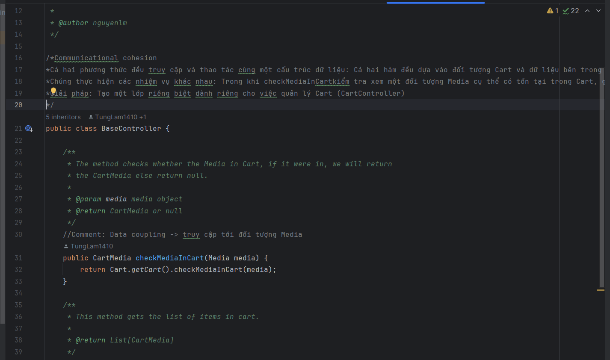

# TKXDPM.KHMT.20231-12
## Lời cảm ơn
Nhóm 12 chúng em xin chân thành cảm ơn cô Nguyễn Thị Thu Trang và anh Lê Thanh Giang đã nhiệt tình chỉ dạy và hướng dẫn chúng em trong quá trình thực hiện bài tập lớn môn học.

Link video demo: https://www.youtube.com/watch?v=PnwOcS9Pj14&feature=youtu.be
## Author

| Name             | Role        |
|:-----------------| :---------- |
| Nguyễn Đăng Khoa | Team Leader |
| Phạm Duy Khánh   | Member      |
| Phạm Ngọc Khánh  | Member      |
| Đỗ Vũ Tùng Lâm   | Member      |

## Report

  
W11: 27/11/2023~03/12/2023 

 

Nguyen Dang Khoa - 20204572

 

- Assigned tasks:
    - Find coupling in class PlaceOrderController

- Implementation details:
    - Pull Request(s): https://github.com/henrynguyen13/TKXDPM.KHMT.20231-12/pull/2
    - Specific implementation details:
        - Find coupling in class PlaceOrderController

Pham Duy Khanh - 20204570

 

- Assigned tasks:
    - Find coupling in class Order
    - Find coupling in class CartMedia

- Implementation details:
    - Pull Request(s): https://github.com/henrynguyen13/TKXDPM.KHMT.20231-12/pull/1
    - Specific implementation details:
        - Find coupling in class relation with Order

Do Vu Tung Lam - 20204574

 

- Assigned tasks:
    - Find coupling in class Cart

- Implementation details:
    - Pull Request(s): https://github.com/henrynguyen13/TKXDPM.KHMT.20231-12/pull/3
    - Specific implementation details:
        - Find coupling in class Cart

Pham Ngoc Khanh - 20200324

 

- Assigned tasks:
    - Find coupling in class BaseController
    - Find coupling in class MediaHandler
    - Find coupling in class MediaInvoiceScreenHandler

- Implementation details:
    - Pull Request(s): https://github.com/henrynguyen13/TKXDPM.KHMT.20231-12/pull/4
    - Specific implementation details:
        - Find coupling in class BaseController
        - Find coupling in class MediaHandler
        - Find coupling in class MediaInvoiceScreenHandler

  
W12: 04/12/2023~10/12/2023 

 

Nguyen Dang Khoa - 20204572

 

- Assigned tasks:
    - Find cohesion in controller classes
    - Find reasons and solutions (if have)

- Implementation details:
    - Pull Request(s): https://github.com/henrynguyen13/TKXDPM.KHMT.20231-12/pull/5
    - Specific implementation details:
        - Find some type of cohesions such as: Communicational cohesion, Temporal cohesion, Procedural cohesion
        - Solutions: create other separate class for managing this object, such as CartController
        - Example

Do Vu Tung Lam - 20204574

 

- Assigned tasks:
    - Find cohesion in classes in subsystem folder and utils folder
    - Find reasons and solutions (if have)

- Implementation details:
    - Pull Request(s): https://github.com/henrynguyen13/TKXDPM.KHMT.20231-12/pull/7
    - Specific implementation details:
        - Find some type of cohesion such as: Communicational cohesion, Coincidental cohesion, Functional cohesion
        - Find the reason of those cohesions

Pham Duy Khanh - 20204570

 

- Assigned tasks:
    - Find cohesion in classes in views folder
    - Find reasons and solutions (if have)

- Implementation details:
    - Pull Request(s): https://github.com/henrynguyen13/TKXDPM.KHMT.20231-12/pull/8
    - Specific implementation details:
        - Find type of cohesion such as: Functional cohesion
        - Find the reason of those cohesions

Pham Ngoc Khanh - 20200324

 

- Assigned tasks:
    - Find cohesion in classes in entity folder
    - Find reasons and solutions (if have)

- Implementation details:
    - Pull Request(s): https://github.com/henrynguyen13/TKXDPM.KHMT.20231-12/pull/6
    - Specific implementation details:
        - Find type of cohesion such as: Functional cohesion
        - Find the reason of those cohesions

  
W13: 11/12/2023~17/12/2023 

 

Nguyen Dang Khoa - 20204572

 

- Assigned tasks:
    - Find violations of the SOLID principle in Controller and Handler class
    - Find reasons and solutions (if have)

- Implementation details:
    - Pull Request(s): https://github.com/henrynguyen13/TKXDPM.KHMT.20231-12/pull/10
    - Specific implementation details:
        - Find violations of the SOLID principle in Controller and Handler class 
        - Find the reason of those violations
        - More details, I found violations in PaymentController class (SRP)

Do Vu Tung Lam - 20204574

 

- Assigned tasks:
    - Find violations of the SOLID principle in PlaceOrderController class
    - Find reasons and solutions (if have)

- Implementation details:
    - Pull Request(s): https://github.com/henrynguyen13/TKXDPM.KHMT.20231-12/pull/9
    - Specific implementation details:
        - Find violations of the SOLID principle in PlaceOrderController class such as: Single Responsibility Principle and Dependency Inversion Principle
        - Find the reason of those violations

Pham Ngoc Khanh - 20200324

 

- Assigned tasks:
    - Find violations of the SOLID principle in Utils class
    - Find reasons and solutions (if have)

- Implementation details:
    - Pull Request(s): https://github.com/henrynguyen13/TKXDPM.KHMT.20231-12/pull/13
    - Specific implementation details:
        - Find violations of the SOLID principle in Utils class such as: Single Responsibility Principle 
        - Find the reason of those violations

Pham Duy Khanh - 20204570

 

- Assigned tasks:
    - Find violations of the SOLID principle in Entity class
    - Find reasons and solutions (if have)

- Implementation details:
    - Pull Request(s): https://github.com/henrynguyen13/TKXDPM.KHMT.20231-12/pull/14
    - Specific implementation details:
        - Find violations of the SOLID principle in Entity class such as: Open/Close Principle
        - Find the reason of those violations

  
W14-W17: 18/12/2023~06/01/2023 

 

Nguyen Dang Khoa - 20204572

 

- Assigned tasks:
   - Viết tài liệu đặc tả, thiết kế
   - Dựng base front-end
   - Đảm nhận phần: Trang chủ, danh sách sản phẩm, thêm sản phẩm vào giỏ, xem chi tiết sản phẩm, tìm kiếm và lọc sản phẩm

- Implementation details:
    - Người dùng có thể thêm sản phẩm vào giỏ hàng, xem chi tiết sản phẩm, lọc sản phẩm theo loại: CD, DVD, Book, LP và theo giá: Từ cao xuống thấp và từ thấp đến cao
    - Người dùng có thể phân trang, tìm kiếm sản phẩm theo tên

Do Vu Tung Lam - 20204574

 

- Assigned tasks:
    - Viết tài liệu đặc tả, thiết kế
    - Đảm nhận phần: Quản lý giỏ hàng, thanh toán (FE), xử lý trang kết quả, trang lịch sử và hủy đơn hàng

- Implementation details:
    - Người dùng có thể thêm/sửa xóa số lượng sản phẩm, đặt hàng
    - Người dùng thanh toán bằng VNPay sandbox
    - Sau khi thanh toán thành công sẽ hiện kết quả giao dịch
    - Người dùng có thể xem lịch sử đơn hàng

Pham Ngoc Khanh - 20200324

 

- Assigned tasks:
    - Viết tài liệu đặc tả, thiết kế
    - Đảm nhận phần: hóa đơn
- Implementation details:
    - Sau khi điền thông tin giao hàng, màn hình sẽ hiển thị hóa đơn

Pham Duy Khanh - 20204570

 

- Assigned tasks:
    - Viết tài liệu đặc tả, thiết kế
   - Dựng base back-end
   - Đảm nhận phần: Thông tin đơn hàng, thanh toán VNPay (backend)

- Implementation details:
    - Sau khi đặt hàng trong giỏ hàng, người dùng sẽ phải điền thông tin đơn hàng
    - Người dùng có thể chọn thanh toán bằng giao hàng thường/ giao hàng nhanh
    - Sau khi chọn Tỉnh/Thành phố, phí ship sẽ hiện ra
    - Người dùng thanh toán bằng VNPay

